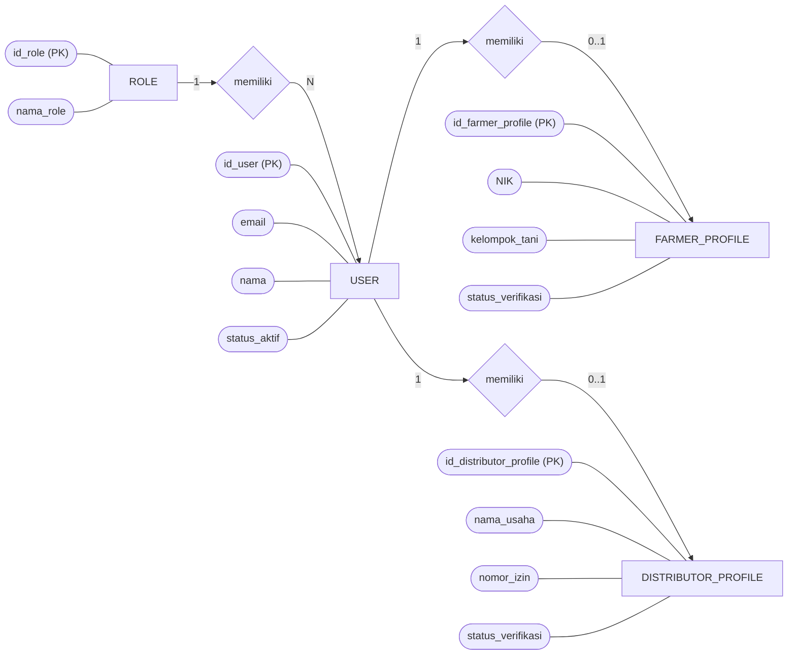
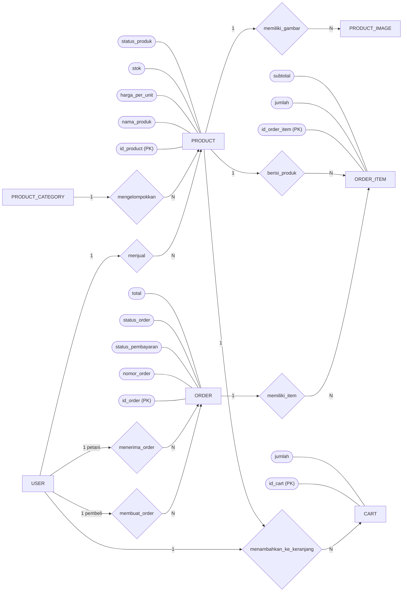
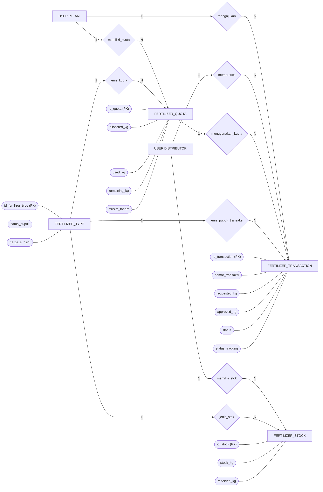
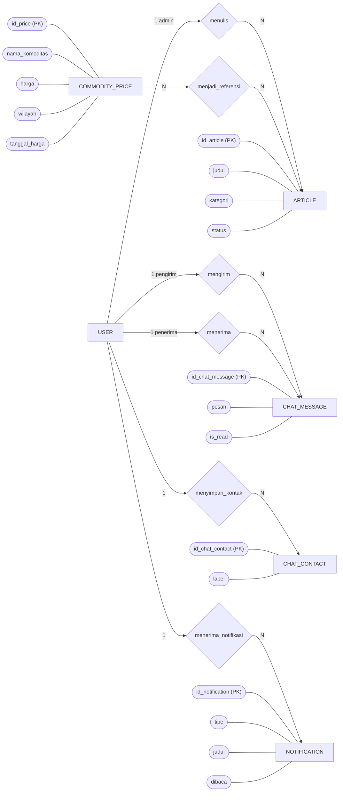
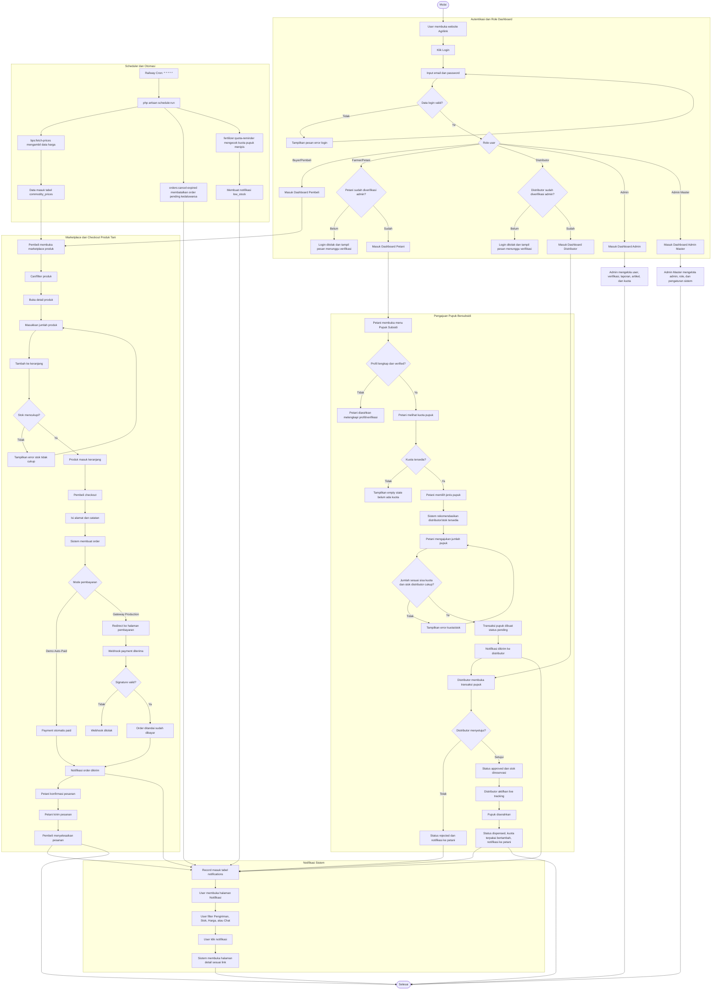

# 7. Cost & Resource Estimation

Bagian ini berisi estimasi biaya infrastruktur penunjang sistem dan estimasi kebutuhan tim untuk pengembangan serta operasional sistem Agrilink.

## 7.1 Estimasi Biaya Infrastruktur

Estimasi berikut dibuat untuk kebutuhan tahap demo, pengembangan, dan deployment awal. Biaya dapat berubah sesuai layanan yang digunakan, jumlah pengguna, kapasitas database, storage, dan kebutuhan traffic.

| No | Komponen Infrastruktur | Layanan/Tools | Kebutuhan | Estimasi Biaya/Bulan | Keterangan |
|---|---|---|---|---:|---|
| 1 | Hosting aplikasi | Railway | Menjalankan aplikasi Laravel production | Rp 0 - Rp 80.000 | Bisa memakai free/trial credit atau paket kecil untuk demo. |
| 2 | Database cloud | TiDB Cloud | Menyimpan data user, produk, transaksi, pupuk, artikel, dan notifikasi | Rp 0 | Menggunakan free tier TiDB Cloud untuk tahap awal. |
| 3 | Domain | Domain `.com` / `.id` | Alamat website resmi | Rp 15.000 - Rp 30.000 | Jika dihitung bulanan dari biaya tahunan domain. |
| 4 | Storage file upload | Local storage / Railway volume / Cloud storage | Menyimpan foto profil dan gambar produk | Rp 0 - Rp 50.000 | Untuk production lebih aman memakai storage persistent/cloud. |
| 5 | SSL/HTTPS | Railway / Cloudflare | Keamanan akses website | Rp 0 | Umumnya sudah tersedia gratis dari platform hosting. |
| 6 | Email service | Belum digunakan / opsional SMTP Gmail, Mailtrap, atau Resend | Forgot password dan email verifikasi jika fitur email production diaktifkan | Rp 0 - Rp 50.000 | Pada versi saat ini email service production belum dikonfigurasi; komponen ini bersifat opsional untuk pengembangan berikutnya. |
| 7 | API data harga | BPS Web API | Sinkron data harga komoditas | Rp 0 | Menggunakan API/sumber data publik BPS. |
| 8 | Monitoring dasar | Railway logs / Laravel logs | Melihat error dan performa aplikasi | Rp 0 | Cukup untuk tahap awal. |
| 9 | Backup database | Export manual / TiDB backup | Cadangan data sistem | Rp 0 - Rp 50.000 | Bisa dilakukan manual untuk demo, otomatis untuk production. |
| 10 | Asset optimization | Tools kompres gambar/video | Mengurangi ukuran gambar/video | Rp 0 | Bisa memakai tools gratis seperti Squoosh, TinyPNG, atau FFmpeg. |

Total estimasi biaya infrastruktur tahap awal:

| Skenario | Estimasi Biaya/Bulan | Keterangan |
|---|---:|---|
| Demo/Praktikum | Rp 0 - Rp 50.000 | Memakai free tier Railway/TiDB dan domain lokal/subdomain. |
| Production kecil | Rp 100.000 - Rp 250.000 | Hosting kecil, domain, storage, dan email service dasar. |
| Production berkembang | Rp 300.000 - Rp 1.000.000+ | Jika traffic naik, butuh storage, backup, monitoring, dan resource server lebih besar. |

## 7.2 Estimasi Biaya Kebutuhan Tim

Pengembangan sistem Agrilink pada tahap praktikum dikerjakan oleh 3 mahasiswa. Karena proyek ini merupakan tugas akademik, biaya aktual untuk kebutuhan tim adalah Rp 0. Namun, tabel berikut tetap menampilkan estimasi nilai kontribusi jika pekerjaan serupa dihitung sebagai biaya jasa pengembangan.

| No | Nama Anggota | Bagian yang Dikerjakan | Estimasi Durasi | Biaya Aktual | Estimasi Nilai Kontribusi |
|---|---|---|---|---:|---:|
| 1 | Alpin Aditya | Landing page, halaman login, halaman register, dashboard admin, dashboard buyer/pembeli, desain UI, deployment Railway, upload database ke TiDB Cloud, serta pengisian sumber BPS untuk artikel. | 4 - 8 minggu | Rp 0 | Rp 4.000.000 - Rp 9.000.000 |
| 2 | Fadel | Dashboard distributor, fitur stok pupuk, transaksi pupuk distributor, dan tampilan pendukung distributor. | 4 - 8 minggu | Rp 0 | Rp 2.000.000 - Rp 5.000.000 |
| 3 | Julia | Dashboard petani, fitur petani, pengajuan pupuk, pesanan petani, dan laporan. | 4 - 8 minggu | Rp 0 | Rp 2.000.000 - Rp 5.000.000 |

Pembagian pekerjaan tim:

| Area Pekerjaan | Penanggung Jawab | Keterangan |
|---|---|---|
| Landing Page | Alpin Aditya | Membuat halaman awal Agrilink agar terlihat informatif dan menarik. |
| Login & Register | Alpin Aditya | Membuat alur autentikasi, tampilan form, akun demo, dan validasi tampilan. |
| Dashboard Admin | Alpin Aditya | Menyusun tampilan ringkasan admin, data pengguna, statistik, dan menu manajemen. |
| Dashboard Buyer/Pembeli | Alpin Aditya | Menyusun tampilan marketplace, keranjang, pesanan, dan harga komoditas untuk pembeli. |
| Desain UI/UX | Alpin Aditya | Mendesain tampilan halaman publik, auth, dan dashboard agar lebih rapi, modern, dan siap presentasi. |
| Deployment/Hosting | Alpin Aditya | Melakukan deployment/hosting aplikasi di Railway. |
| Database Cloud | Alpin Aditya | Mengupload dan mengonfigurasi database project ke TiDB Cloud. |
| Konten BPS Artikel | Alpin Aditya | Mengisi dan menyesuaikan sumber data BPS untuk kebutuhan artikel dan informasi harga komoditas. |
| Dashboard Distributor | Fadel | Mengelola tampilan stok pupuk, riwayat stok, transaksi pupuk, dan status distribusi. |
| Dashboard Petani | Julia | Mengelola tampilan produk petani, pesanan masuk, subsidi pupuk, dan informasi kuota. |
| Laporan | Julia | Menyusun bagian laporan dan kebutuhan data pendukung untuk monitoring sistem. |

Catatan:

Seluruh proses pengembangan, perbaikan bug, penyusunan dokumentasi, desain UI, deployment, pengisian data BPS, serta troubleshooting teknis dibantu menggunakan Codex/AI sebagai asisten pengembangan.

Total estimasi biaya kebutuhan tim:

| Skenario Tim | Estimasi Biaya | Keterangan |
|---|---:|---|
| Tim mahasiswa/praktikum | Rp 0 | Dikerjakan oleh 3 mahasiswa sebagai tugas akademik. |
| Nilai kontribusi ekuivalen | Rp 8.000.000 - Rp 20.000.000 | Perkiraan nilai pekerjaan jika dihitung sebagai jasa pengembangan prototype, deployment, desain, dan pengisian data. |
| Pengembangan lanjutan | Rp 20.000.000+ | Jika fitur diperluas dengan analytics, export laporan, audit log, storage cloud, dan integrasi production penuh. |

## 7.3 Ringkasan Resource yang Dibutuhkan

| Kategori | Resource Minimal | Resource Ideal |
|---|---|---|
| Server aplikasi | 1 service Railway kecil | 1 web service + 1 cron service |
| Database | TiDB Cloud free tier | TiDB Cloud dengan backup rutin |
| Storage | Local/public storage | Cloudflare R2/S3/Supabase Storage |
| Scheduler | Manual `php artisan schedule:run` | Railway Cron `* * * * *` |
| Tim | 2 - 3 orang | 5 - 7 role sesuai kebutuhan |
| Testing | Manual browser dan Postman | Automated test + manual QA |
| Monitoring | Laravel log | Railway log + error monitoring |

Kesimpulan:

Untuk tahap praktikum dan presentasi, Agrilink masih bisa berjalan dengan biaya rendah karena memanfaatkan free tier Railway/TiDB dan tools open-source. Untuk tahap production, biaya terbesar kemungkinan berasal dari hosting, storage persistent, domain, email service, backup database, dan kebutuhan tim maintenance.

# 8. Deployment dan Setup Database

Bagian ini menjelaskan cara deploy sistem Agrilink ke Railway dan cara setup database menggunakan TiDB Cloud.

## 8.1 Cara Deploy Sistem ke Railway

Langkah-langkah deploy sistem:

1. Siapkan repository GitHub.

   Project Agrilink disimpan di GitHub agar dapat dihubungkan ke Railway.

   ```bash
   git add .
   git commit -m "Update project Agrilink"
   git push origin main
   ```

2. Login ke Railway.

   Buka website Railway:

   ```text
   https://railway.app
   ```

3. Buat project baru di Railway.

   Pilih:

   ```text
   New Project -> Deploy from GitHub Repo
   ```

   Lalu pilih repository:

   ```text
   alpinaditya401/agri-system
   ```

4. Atur environment variable di Railway.

   Masuk ke menu:

   ```text
   Project -> Service -> Variables
   ```

   Tambahkan konfigurasi utama:

   ```env
   APP_NAME=Agrilink
   APP_ENV=production
   APP_DEBUG=false
   APP_URL=https://nama-domain-railway.up.railway.app

   DB_CONNECTION=mysql
   DB_HOST=HOST_TIDB
   DB_PORT=4000
   DB_DATABASE=agri_system
   DB_USERNAME=USERNAME_TIDB
   DB_PASSWORD=PASSWORD_TIDB

   PAYMENT_GATEWAY=demo
   BPS_API_KEY=isi_api_key_bps_jika_digunakan
   ```

5. Generate APP_KEY.

   Jalankan command berikut di lokal:

   ```bash
   php artisan key:generate --show
   ```

   Copy hasilnya, lalu masukkan ke Railway:

   ```env
   APP_KEY=base64:xxxxxxxxxxxxxxxxxxxxxxxx
   ```

6. Deploy aplikasi.

   Setelah environment variable selesai, Railway akan menjalankan proses build dan deploy otomatis dari GitHub.

7. Jalankan migration di Railway.

   Masuk ke Railway SSH atau gunakan Railway CLI, lalu jalankan:

   ```bash
   php artisan migrate --force
   ```

8. Jalankan seeder data demo jika diperlukan.

   ```bash
   php artisan db:seed --force
   php artisan db:seed --class=RichDashboardDataSeeder --force
   php artisan db:seed --class=BpsSourceArticleSeeder --force
   ```

9. Buat storage link.

   ```bash
   php artisan storage:link
   ```

10. Jalankan build frontend.

   Railway akan menjalankan build otomatis. Jika menjalankan manual:

   ```bash
   npm install
   npm run build
   ```

11. Setup scheduler Railway.

   Laravel scheduler tidak otomatis berjalan hanya dari web service utama. Buat service/cron job terpisah:

   ```text
   Cron Schedule: * * * * *
   Start Command: php artisan schedule:run
   ```

   Scheduler ini menjalankan command seperti:

   ```text
   bps:fetch-prices
   orders:cancel-expired
   fertilizer:quota-reminder
   ```

## 8.2 Cara Setup Database TiDB Cloud

Langkah-langkah setup database:

1. Buka TiDB Cloud.

   ```text
   https://tidbcloud.com
   ```

2. Buat cluster database.

   Pilih region terdekat, misalnya:

   ```text
   Asia Pacific / Singapore
   ```

3. Buat database.

   Nama database yang digunakan:

   ```text
   agri_system
   ```

   Jika membuat lewat MySQL CLI:

   ```bash
   mysql -h HOST_TIDB -P 4000 -u USERNAME_TIDB -p -e "CREATE DATABASE IF NOT EXISTS agri_system;"
   ```

4. Ambil credential koneksi.

   Dari dashboard TiDB Cloud, ambil:

   ```text
   Host
   Port
   Username
   Password
   Database
   ```

5. Masukkan credential ke `.env` lokal atau Railway Variables.

   ```env
   DB_CONNECTION=mysql
   DB_HOST=HOST_TIDB
   DB_PORT=4000
   DB_DATABASE=agri_system
   DB_USERNAME=USERNAME_TIDB
   DB_PASSWORD=PASSWORD_TIDB
   ```

6. Import database dari file SQL jika sudah punya export.

   Contoh command Windows:

   ```bash
   "C:\xampp\mysql\bin\mysql.exe" -h HOST_TIDB -P 4000 -u USERNAME_TIDB -p -D agri_system < "C:\xampp\htdocs\agri-system\database\exports\agri_system_tidb_full.sql"
   ```

   Jika MySQL XAMPP tidak mendukung `--ssl-mode`, gunakan command tanpa opsi tersebut atau gunakan client MySQL yang lebih baru.

7. Alternatif setup database dengan migration Laravel.

   Jika tidak import SQL manual, cukup jalankan:

   ```bash
   php artisan migrate --force
   php artisan db:seed --force
   ```

8. Cek koneksi database.

   Jalankan:

   ```bash
   php artisan migrate:status
   ```

   Jika daftar migration muncul, berarti Laravel sudah berhasil terhubung ke TiDB Cloud.

9. Cek data dashboard.

   Jika data masih kosong, jalankan:

   ```bash
   php artisan db:seed --class=RichDashboardDataSeeder --force
   php artisan db:seed --class=BpsSourceArticleSeeder --force
   ```

10. Catatan penting setup database.

   - Jangan menjalankan `php artisan migrate:fresh --seed` di production karena akan menghapus seluruh data.
   - Gunakan `php artisan migrate --force` untuk production.
   - Backup database sebelum import ulang file SQL.
   - Pastikan credential TiDB di Railway sama dengan credential TiDB Cloud.
   - Gunakan mode payment `demo` jika payment gateway production belum dipakai.

# 9. Troubleshooting Log

Daftar bug/error yang pernah terjadi selama pengembangan sistem Agrilink beserta solusi yang dilakukan.

| Kode Bug | Nama Modul | Keterangan | Solusi | Bukti |
|---|---|---|---|---|
| BUG01 | Harga Komoditas | Error 500 `Undefined variable $note` pada `resources/views/public/prices.blade.php`. | Menambahkan pengecekan/default variabel agar view tidak membaca `$note` saat belum tersedia. | `LAPORAN_TROUBLESHOOTING_PROMPTING` |
| BUG02 | Pupuk Subsidi Petani | Halaman `/petani/pupuk-subsidi` berpotensi error karena middleware `farmer.verified` belum konsisten. | Membuat/menyesuaikan middleware verifikasi petani dan memastikan route petani hanya bisa diakses petani terverifikasi. | `LAPORAN_TROUBLESHOOTING_PROMPTING` |
| BUG03 | Laporan Distribusi Pupuk | Halaman `/admin/laporan/distribusi-pupuk` error/kurang stabil saat data laporan dipanggil. | Audit route, controller, model, dan view laporan; menyesuaikan query dan tampilan laporan distribusi pupuk. | `LAPORAN_TROUBLESHOOTING_PROMPTING` |
| BUG04 | Payment Webhook | Endpoint `/api/payment/webhook` belum memvalidasi signature sehingga rawan request palsu. | Mengaktifkan validasi signature webhook Midtrans/Xendit sebelum mengubah status payment/order. | `LAPORAN_TROUBLESHOOTING_PROMPTING` |
| BUG05 | Checkout | Saat klik produk/checkout, halaman refresh tanpa feedback walaupun produk masuk keranjang. | Menambahkan feedback success/error dan memperbaiki alur cart/checkout agar user tahu aksi berhasil. | `LAPORAN_TROUBLESHOOTING_PROMPTING` |
| BUG06 | Payment Gateway | Checkout gagal dengan pesan `Payment gateway belum dikonfigurasi`. | Menambahkan mode `Demo Auto-Paid` dan pengaturan payment gateway di Admin Master agar demo tetap bisa berjalan tanpa Midtrans. | `LAPORAN_TROUBLESHOOTING_PROMPTING` |
| BUG07 | Total Checkout | Total pesanan tidak sesuai karena ada PPN/tax yang membingungkan. | Menghapus PPN dari perhitungan demo sehingga total = subtotal + ongkir. | `LAPORAN_TROUBLESHOOTING_PROMPTING` |
| BUG08 | Register | Form register menampilkan error `validation.lowercase`. | Menyesuaikan validasi/translasi agar field tidak memunculkan pesan mentah dan input email/nama diproses benar. | `LAPORAN_TROUBLESHOOTING_PROMPTING` |
| BUG09 | Forgot Password | Error 500: tabel `password_reset_tokens` tidak ditemukan. | Menambahkan/memastikan migration tabel reset password lalu menjalankan `php artisan migrate`. | `LAPORAN_TROUBLESHOOTING_PROMPTING` |
| BUG10 | Login Redirect | Setelah login sempat stuck ke `/api/notifications/summary`. | Memperbaiki redirect intended agar endpoint API notifikasi tidak menjadi tujuan halaman setelah login. | `LAPORAN_TROUBLESHOOTING_PROMPTING` |
| BUG11 | Foto Profil Chat | Foto profil sudah berubah di profil tetapi belum berubah di chat. | Menyesuaikan tampilan/avatar chat agar memakai `profile_photo_path` terbaru. | `LAPORAN_TROUBLESHOOTING_PROMPTING` |
| BUG12 | Chat | Semua kontak langsung muncul di fitur chat sehingga tidak rapi. | Menambahkan CRUD kontak chat dan pencarian kontak agar user memilih kontak yang ingin ditambahkan. | `LAPORAN_TROUBLESHOOTING_PROMPTING` |
| BUG13 | Admin Master | Admin Master belum punya pembeda fitur dari admin biasa. | Menambahkan pemisahan akses Admin dan Admin Master, termasuk kontrol admin/role user. | `LAPORAN_TROUBLESHOOTING_PROMPTING` |
| BUG14 | Dashboard Tablet | Dashboard admin/buyer mengalami horizontal overflow pada ukuran tablet. | Mengubah breakpoint layout sidebar dari `md` ke `lg` agar tablet memakai layout mobile/topbar. | `LAPORAN_TROUBLESHOOTING_PROMPTING` |
| BUG15 | Scheduler Railway | Scheduler Laravel tidak otomatis berjalan di Railway. | Menambahkan dokumentasi Railway Cron Job: `* * * * *` dengan command `php artisan schedule:run`. | `LAPORAN_TROUBLESHOOTING_PROMPTING` |
| BUG16 | Notifikasi Order | Perubahan status order belum selalu menghasilkan notifikasi. | Membuat/menyesuaikan `OrderNotificationService` untuk event dibayar, dikonfirmasi, dikirim, selesai, dan dibatalkan. | `LAPORAN_TROUBLESHOOTING_PROMPTING` |
| BUG17 | Reminder Kuota Pupuk | Command `fertilizer:quota-reminder` hanya log, belum mengirim notifikasi. | Mengubah command agar membuat notifikasi `low_stock` dan mencegah spam lebih dari sekali per hari. | `LAPORAN_TROUBLESHOOTING_PROMPTING` |
| BUG18 | Artikel | Cover artikel fallback ke gambar yang sama semua. | Menambahkan mapping cover berdasarkan kategori/topik artikel dengan aset lokal yang tersedia. | `LAPORAN_TROUBLESHOOTING_PROMPTING` |
| BUG19 | Deploy TiDB | Import SQL ke TiDB gagal karena path CA/file salah dan opsi `ssl-mode` tidak didukung MySQL XAMPP. | Menggunakan command MySQL yang sesuai, memperbaiki path file SQL, dan memakai opsi SSL yang kompatibel. | `LAPORAN_TROUBLESHOOTING_PROMPTING` |
| BUG20 | Asset Project | Ukuran project terlalu besar untuk deploy/hosting. | Mengompres aset gambar/video, menghapus file tidak perlu, dan menyarankan aset production lebih ringan. | `LAPORAN_TROUBLESHOOTING_PROMPTING` |

# 10. Prompting

Daftar prompt yang digunakan untuk membuat, mengedit, memperbaiki, dan menyelesaikan sistem Agrilink.

Keterangan kegunaan prompt:

- General: prompt untuk arahan umum, deployment, dokumentasi, atau penjelasan.
- Generate kode: prompt untuk membuat fitur atau kode baru.
- Edit Code: prompt untuk mengubah/menyesuaikan kode yang sudah ada.
- Solving Error: prompt untuk mencari dan memperbaiki bug/error.

| No | Nama Tools AI | Teks Prompt | Kegunaan Prompt | Link Bukti |
|---|---|---|---|---|
| 1 | Codex | Perbaiki error `Undefined variable $note` pada halaman harga komoditas Laravel. | Solving Error | `LAPORAN_TROUBLESHOOTING_PROMPTING` |
| 2 | Codex | Tambahkan link sumber data BPS utuh pada artikel dan halaman harga komoditas. | Edit Code | `LAPORAN_TROUBLESHOOTING_PROMPTING` |
| 3 | Codex | Sesuaikan tampilan peta agar hanya menampilkan wilayah Indonesia. | Edit Code | `LAPORAN_TROUBLESHOOTING_PROMPTING` |
| 4 | Codex | Redesign UI bagian produk, dashboard, login, dan register agar lebih rapi dan modern. | Edit Code | `LAPORAN_TROUBLESHOOTING_PROMPTING` |
| 5 | Codex | Tambahkan daftar akun demo Buyer, Petani, Distributor, Admin, dan Admin Master pada halaman login. | Generate kode | `LAPORAN_TROUBLESHOOTING_PROMPTING` |
| 6 | Codex | Bedakan role Admin dan Admin Master agar Admin Master dapat mengatur role semua user. | Generate kode | `LAPORAN_TROUBLESHOOTING_PROMPTING` |
| 7 | Codex | Perbaiki error halaman `/petani/pupuk-subsidi` dan `/admin/laporan/distribusi-pupuk`. | Solving Error | `LAPORAN_TROUBLESHOOTING_PROMPTING` |
| 8 | Codex | Audit dan perbaiki payment webhook signature agar tidak bisa menerima request palsu. | Solving Error | `LAPORAN_TROUBLESHOOTING_PROMPTING` |
| 9 | Codex | Tambahkan fitur forgot password dan reset password Laravel. | Generate kode | `LAPORAN_TROUBLESHOOTING_PROMPTING` |
| 10 | Codex | Tambahkan upload foto produk agar petani bisa upload gambar dari perangkat. | Generate kode | `LAPORAN_TROUBLESHOOTING_PROMPTING` |
| 11 | Codex | Buat endpoint RESTful API hasil panen dengan Laravel Sanctum, Form Request, Resource, dan CRUD lengkap. | Generate kode | `LAPORAN_TROUBLESHOOTING_PROMPTING` |
| 12 | Codex | Tambahkan fitur filter/search produk berdasarkan kategori, keyword, dan rentang tanggal. | Edit Code | `LAPORAN_TROUBLESHOOTING_PROMPTING` |
| 13 | Codex | Perbaiki checkout agar tidak stuck setelah produk masuk ke keranjang. | Solving Error | `LAPORAN_TROUBLESHOOTING_PROMPTING` |
| 14 | Codex | Hapus perhitungan PPN agar total checkout sesuai subtotal dan ongkir. | Edit Code | `LAPORAN_TROUBLESHOOTING_PROMPTING` |
| 15 | Codex | Tambahkan backend upload foto profil untuk semua user dan admin. | Generate kode | `LAPORAN_TROUBLESHOOTING_PROMPTING` |
| 16 | Codex | Perbaiki error validasi `validation.lowercase` pada halaman register. | Solving Error | `LAPORAN_TROUBLESHOOTING_PROMPTING` |
| 17 | Codex | Perbaiki error tabel `password_reset_tokens` tidak ditemukan saat forgot password. | Solving Error | `LAPORAN_TROUBLESHOOTING_PROMPTING` |
| 18 | Codex | Tambahkan CRUD kontak chat agar tidak semua kontak langsung muncul di fitur chat. | Generate kode | `LAPORAN_TROUBLESHOOTING_PROMPTING` |
| 19 | Codex | Tambahkan fitur user bisa mengajukan sebagai petani dan distributor, lalu admin dapat menerima atau menolak. | Generate kode | `LAPORAN_TROUBLESHOOTING_PROMPTING` |
| 20 | Codex | Tambahkan live tracking pesanan/distribusi agar posisi distributor bisa dipantau. | Generate kode | `LAPORAN_TROUBLESHOOTING_PROMPTING` |
| 21 | Codex | Kompres aset gambar/video dan kurangi ukuran project agar lebih ringan untuk deploy. | General | `LAPORAN_TROUBLESHOOTING_PROMPTING` |
| 22 | Codex | Bantu deploy project Laravel Agrilink ke Railway dengan database TiDB. | General | `LAPORAN_TROUBLESHOOTING_PROMPTING` |
| 23 | Codex | Perbaiki redirect login yang sempat stuck ke `/api/notifications/summary`. | Solving Error | `LAPORAN_TROUBLESHOOTING_PROMPTING` |
| 24 | Codex | Tambahkan banyak data demo untuk dashboard, harga komoditas, distribusi pupuk, produk, dan laporan. | Generate kode | `LAPORAN_TROUBLESHOOTING_PROMPTING` |
| 25 | Codex | Tambahkan chart dan fitur compare komoditas pada halaman harga komoditas. | Generate kode | `LAPORAN_TROUBLESHOOTING_PROMPTING` |
| 26 | Codex | Audit semua fitur dari landing page, login, register, admin, buyer, farmer, dan distributor lalu perbaiki bug yang ditemukan. | Solving Error | `LAPORAN_TROUBLESHOOTING_PROMPTING` |
| 27 | Codex | Perbaiki scheduler Laravel, notifikasi order, reminder kuota pupuk, sidebar distributor, dan status pesanan. | Edit Code | `LAPORAN_TROUBLESHOOTING_PROMPTING` |
| 28 | Codex | Buat dokumentasi Railway scheduler dan README agar sesuai dengan kode project. | General | `LAPORAN_TROUBLESHOOTING_PROMPTING` |

# Catatan Bukti

Karena link deeplink `codex://threads/...` tidak selalu bisa dibuka di luar aplikasi Codex, kolom bukti diisi menggunakan nama file screenshot/lampiran.

1. Screenshot chat prompt dan jawaban AI.
2. Screenshot halaman sebelum dan sesudah diperbaiki.
3. Screenshot terminal hasil command seperti `php artisan test`, `php artisan schedule:list`, atau `npm run build`.
4. Link commit GitHub jika perubahan sudah dipush ke repository.

Contoh bukti yang direkomendasikan:

- Screenshot error Laravel sebelum diperbaiki.
- Screenshot halaman dashboard setelah berhasil dibuka.
- Screenshot Postman/API test.
- Screenshot `php artisan test` berhasil.
- Screenshot commit GitHub yang berisi perubahan.

# 11. ERD Sistem Agrilink

ERD yang digunakan adalah **ERD Chen**. Pada notasi Chen:

- Entity digambarkan sebagai kotak.
- Relationship digambarkan sebagai belah ketupat.
- Attribute digambarkan sebagai oval.
- Kardinalitas ditulis pada garis relasi, misalnya `1`, `N`, atau `1:1`.

Catatan: Mermaid tidak memiliki sintaks khusus ERD Chen, sehingga diagram Chen berikut direpresentasikan memakai `flowchart` dengan bentuk node yang disesuaikan.

## 11.1 ERD Chen - User dan Role



## 11.2 ERD Chen - Marketplace Produk Tani



## 11.3 ERD Chen - Pupuk Bersubsidi



## 11.4 ERD Chen - Chat, Notifikasi, Artikel, dan Harga Komoditas



# 12. Flowchart Sistem Agrilink

Flowchart berikut dibuat dalam satu diagram Mermaid terpadu. Setiap fungsi utama dipisahkan memakai `subgraph`, sehingga alur login, marketplace, pupuk bersubsidi, notifikasi, dan scheduler tetap terlihat sebagai bagian dari satu sistem Agrilink.


